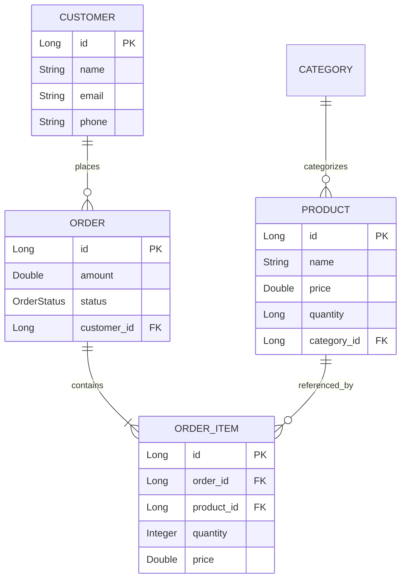

# 🛒 OrderFlow

Welcome to **OrderFlow**! A backend order management microservice built with **Java 21**, **Spring Boot**, and **MySQL**. 

OrderFlow is designed to handle order processing, real-time inventory adjustments, state transitions, and filtering.

---

## 🌟 What Makes OrderFlow Special?

Managing e-commerce orders gets tricky when dealing with stock reservation, cancellation refunds/restocking, and status validation. OrderFlow solves these problems:

- **⚡ Automatic Inventory Reservation**: When an order is placed, item stock is decremented immediately.
- **🔄 Intelligent Order Cancellation**: Cancelling an order automatically restores reserved product quantities back to stock within a single database transaction (`@Transactional`).
- **🛡️ Strict Status Transitions**: Orders follow a valid lifecycle (`PENDING` $\rightarrow$ `CONFIRMED` $\rightarrow$ `SHIPPED` $\rightarrow$ `DELIVERED`). Invalid transitions (like moving directly from `PENDING` to `DELIVERED`) are rejected with clear validation error messages.
- **📊 Pagination & Custom Sorting**: All listing endpoints support page size, page number, and dynamic field sorting out-of-the-box.

---

## 🏗️ Architecture & Data Model

OrderFlow connects Customers, Orders, Line Items, Products, and Categories:



---

## 🛠️ Tech Stack

- **Java 21** & **Spring Boot**
- **Spring Data JPA** & **Hibernate**
- **MySQL 8.4** (Production & Docker)
- **H2 Database** (In-Memory for Integration & Unit Tests)
- **Docker & Docker Compose**
- **JUnit 5 & Mockito** (30+ automated tests)

---

## 🚀 Getting Started

### Prerequisites
- **JDK 21** or later installed
- **Docker Desktop** (or a local MySQL instance)
- **Maven** (bundled via `./mvnw`)

---

### 1. Configure Environment Variables
Create a `.env` file in the `orderflow` root directory:

```env
DB_URL=jdbc:mysql://localhost:3306/orderflow
DB_USERNAME=root
DB_PASSWORD=root
```

### 2. Start MySQL Container
Use Docker Compose to launch MySQL in seconds:

```bash
docker-compose up -d
```

### 3. Run the Application
Start the Spring Boot server:

```bash
./mvnw spring-boot:run
```
The server will start at `http://localhost:8080`.

---

## 🔌 API Quick Reference

### 📦 Orders API (`/orders`)

| Method | Endpoint | Description |
| :--- | :--- | :--- |
| `POST` | `/orders` | Place a new order (reserves inventory & sets status to `CONFIRMED`) |
| `GET` | `/orders` | List all orders with pagination & sorting (`?page=0&size=10&sort=amount,desc`) |
| `GET` | `/orders/{id}` | Get detailed order summary by Order ID |
| `POST` | `/orders/{id}/status` | Update order status (`PENDING`, `CONFIRMED`, `SHIPPED`, `DELIVERED`) |
| `POST` | `/orders/{id}/cancel` | Cancel an order & automatically return stock to product inventory |
| `GET` | `/orders/customer/{customerId}` | List all orders placed by a specific customer |
| `GET` | `/orders/status/{status}` | Filter orders by status (e.g. `/orders/status/CANCELLED`) |

---

### 💡 Example Requests & Responses

#### Place an Order (`POST /orders`)

**Request Body:**
```json
{
  "customerId": 1,
  "items": [
    {
      "productId": 2,
      "quantity": 2
    }
  ]
}
```

**Response (`201 Created`):**
```json
{
  "orderId": 100,
  "customer": {
    "id": 1,
    "name": "Jane Doe",
    "phone": "9876543210",
    "email": "jane@example.com"
  },
  "amount": 100.0,
  "status": "CONFIRMED",
  "items": [
    {
      "productId": 2,
      "productName": "Wireless Mouse",
      "quantity": 2,
      "price": 100.0
    }
  ]
}
```

#### Cancel an Order (`POST /orders/100/cancel`)

**Response (`200 OK`):**
```json
{
  "orderId": 100,
  "status": "CANCELLED",
  "amount": 100.0
}
```
*(Product stock for item #2 is automatically increased back by 2 in the database)*

---

## 🧪 Running Tests

To run the suite of unit and integration tests:

```bash
./mvnw test
```

---

## 💻 Database Access

To inspect the MySQL database directly:

**Via Docker:**
```bash
docker exec -it orderflow-mysql mysql -u root -proot orderflow
```

**Via Local MySQL CLI:**
```bash
mysql -u root -proot -h localhost -P 3306 orderflow
```
